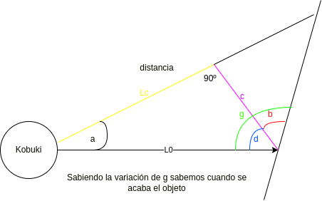
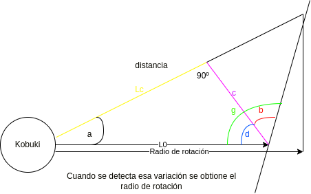
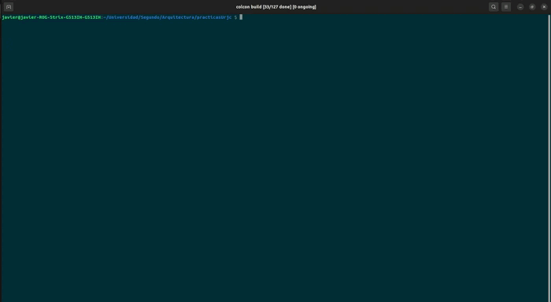
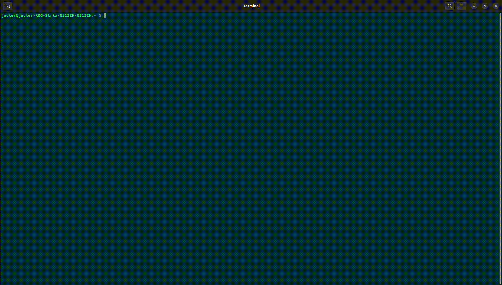
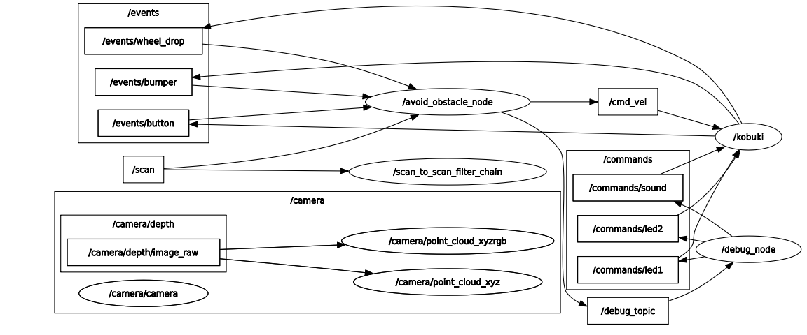
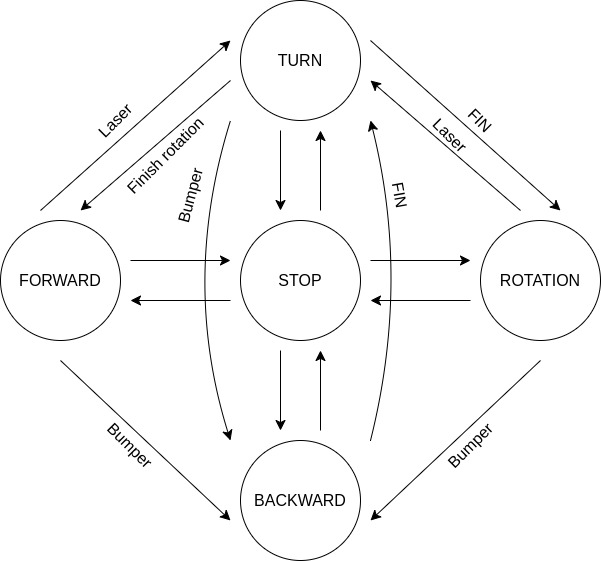

# ASR-0-AvoidObstacle


Práctica 0 - Arquitecturas Software para Robots 2023

Crea un comportamiento autónomo de un robot usando una máquina de estado finito (FSM) para evitar obstáculos:
1. El robot empieza parado, y comienza su comportamiento cuando se pulsa un botón del robot.
2. El robot avanza hasta encontrar un obstáculo a menos de un metro enfrente de él.
3. Cuando encuentra un obstáculo, el robot gira 90 grados, y realiza un movimiento de arco para sobrepasarlo.
4. Si mientras está haciendo el arco, se encuentra un nuevo obstáculo, vuelve a hacer lo mismo del punto 3.


El robot debe funcionar en el robot real Kobuki.

Puntuación (sobre 10):

* +8 correcto funcionamiento en el robot real.
* +2 Readme.md bien documentado con videos.
* -3 Warnings o que no pase los tests.
* +1 Setup de CI/CD

***

# avoid-obstacle-forocoches V.1.0.0


<p align="center">
  
</p>

¡Bienvenidos al repositorio de **avoid-obstacles-forocoches**! Este es un modelo de sistema desarrollado en ROS-2, diseñado para permitir a robots evitar obstáculos utilizando algoritmos de navegación avanzados. Este proyecto es el resultado de la combinación y mejora de varios modelos previos, y su versión actual ha sido diseñada principalmente para su implementación en entornos reales.

En este repositorio, encontrarás todos los componentes necesarios para utilizar este modelo de sistema en tu propio robot. Además, hemos hecho todo lo posible para facilitar la instalación y uso del paquete, lo que significa que puedes poner en marcha tu robot evitando obstáculos en poco tiempo.

Este proyecto ha sido desarrollado por un equipo altamente calificado y dedicado, que ha trabajado duro para mejorar y perfeccionar los modelos previos, así como para desarrollar nuevos componentes que aseguran que el robot pueda moverse de manera segura en entornos con obstáculos. El equipo ha trabajado en estrecha colaboración para asegurar que el modelo sea preciso y eficiente, y que cumpla con los requisitos de los usuarios.

Como introduccion a  nuestro modelo de sistema avoid-obstacles, queremos mostrarles en acción cómo funciona esta solución de navegación. En este video, podrán ver a nuestro robot en acción mientras navega de manera autónoma en un entorno con obstáculos:

https://user-images.githubusercontent.com/92941117/221051373-3c27738c-c656-4f15-8bcb-dc93dd8464cc.mp4

Como pueden ver, nuestro robot evita obstáculos de manera eficiente y segura gracias a las capacidades de navegación avanzadas del modelo de sistema avoid-obstacles. Este modelo utiliza una combinación de técnicas de percepción y planificación para permitir al robot detectar y evitar obstáculos en tiempo real.

Algunas de las capacidades adicionales de nuestro modelo de sistema avoid-obstacles incluyen:

* Un bumper detectar escalones y otros objetos bajos que el lidar no puede detectar.
* Dos botones especiales: uno de detención (B1) y otro de reset (B0).
* Parada de emergencia si el kobuki tiene una de sus ruedas en el aire
* Rotación en ambos sentidos: si detecta un objeto a la derecha girará a la izquierda, y viceversa.
* Zonas de detección dinámicas de objetos 360º
* Interfaz de rviz para visualizar las zonas de detección dinámicas del láser
* LED's para indicar estados de paso y de emergencia
* Sonidos automaticos en caso de errores que requieran de la asitencia del usuario
* Detección en reversa en caso de obstaculos en situaciones de emergencia

Ademas de todo esto, en estas imágenes, podrán ver una **representación gráfica** de la preferencia o atención que nuestro modelo de sistema tiene a los obstáculos ubicados en cada lateral o zona alrededor del robot. Como pueden observar, nuestro modelo de sistema se adapta a su entorno y direccion, lo que le permite detectar obstáculos de manera eficiente en diferentes ubicaciones alrededor del robot.

 <p align="center">
  
  
 </p>

Tambien les mostramos cómo nuestro modelo calcula el giro que el robot debe realizar para evitar el obstáculo detectado. El algoritmo utiliza información de los sensores de percepción del robot para determinar la distancia y orientación del obstáculo y, a partir de ahí, calcula el ángulo de giro que el robot debe realizar para evitar la colisión.

<p align="center">
  
  
</p>

Nota: El uso de la interfaz de debug se ha realizado en un nodo aparte. Para saber más información sobre la interfaz de debug, vaya al siguiente [repositorio](https://github.com/javizqh/Debug-Interface-Kobuki).

## Instalación
Clone el repositorio a un workspace, recomendamos clonarlo en el workspace de creado para alojar [ir_robots](https://github.com/IntelligentRoboticsLabs/ir_robots).
A continuación, compile el código como se muestra en el video:

<p align="center">
    
</p>

```bash
    # Asegurate de estar en el workspace
    colcon build --symlink-install
```

Luego para lanzarlo siga las siguientes instrucciones:

<p align="center">
    
</p>

```bash
    # Asegurate de tener el workspace activado
    # Si no esta activado usa
    source /pathToMyWorkspace/install/setup.bash
    ros2 launch avoid_obstacle_forocoches avoid_obstacle.launch.py 
```

Si quieres usarlo en el simulador usa:

```bash
    # Asegurate de tener el workspace activado
    # Si no esta activado usa
    source /pathToMyWorkspace/install/setup.bash
    # Lanza el simulador en otra terminal
    ros2 launch avoid_obstacle_forocoches avoid_obstacle_sim.launch.py 
    # En otra terminal manda un topic del boton
    ros2 topic pub /events/button kobuki_ros_interfaces/msg/ButtonEvent "button: 1
state: 1" -t 1
```
## Topics usados por este modelo
Este modelo usa 4 subscriptores para recibir información sobre el entorno. Dos de estos subscriptores son para controlar situaciones de emergencia con el bumper (/events/bumper) y para detectar si el kobuki está en el suelo con /events/wheel_drop.

Luego, el modelo publica a 2 topics, uno el del nodo de depuración, que a su vez publica a otros tres más, y el otro es para controlar la velocidad y movimiento del kobuki.

<p align="center">
  
</p>

## Máquina de estados implementada para este modelo
En este diagrama de estados, se observa la diferencia entre diferentes estados de movimiento del robot, incluyendo TURN, ROTATION, FORWARD, STOP y BACKWARD. Cada uno de estos estados representa una acción específica que el robot puede tomar para evitar obstáculos y continuar navegando de manera autónoma.

<p align="center">
  
</p>

Como pueden ver en el diagrama, el robot utiliza una combinación de algoritmos de percepción y planificación para determinar qué estado de movimiento debe utilizar el robot en diferentes situaciones de navegación. Por ejemplo, si el robot detecta un obstáculo en su camino, entrará en el estado de STOP y esperará a que se retire el obstáculo antes de continuar con su ruta.

## Problemas
Como desarrolladores, siempre tratamos de ser honestos y transparentes sobre los problemas que encontramos al trabajar en un proyecto. En este caso, en nuestro proyecto avoid-obstacles, hemos encontrado algunos desafíos que nos gustaría compartir con ustedes.

En primer lugar, al principio de la práctica, nos enfrentamos a un desafío al tratar de instalar ROS2 debido a que ninguno de los miembros del grupo tenía la versión de Ubuntu requerida por Humble. Esto nos llevó algo de tiempo y esfuerzo adicional para solucionar este problema y poder comenzar a trabajar en el proyecto.

Además, uno de los mayores desafíos que encontramos durante el desarrollo de nuestro modelo de sistema avoid-obstacles fue la implementación de parámetros. En programas más pequeños, no tuvimos problemas en implementarlos, pero a medida que aumentaba la complejidad del código, comenzamos a encontrar errores que dificultaban la implementación de los parámetros. Debido a que estábamos cerca de la fecha de entrega y queríamos asegurarnos de que nuestro modelo funcionara correctamente, decidimos posponer la implementación de los parámetros para futuras versiones del modelo.

Otro desafío que encontramos fue con un proyecto secundario que buscaba mejorar la funcionalidad del programa utilizando los 360 grados de rango del LIDAR y predecir el camino más óptimo para rodear o pasar por los obstáculos. Desafortunadamente, este proyecto solo funcionaba de manera consistente en los simuladores y no en los entornos reales. Debido a esto, también decidimos posponer este proyecto para futuras revisiones del modelo.

A pesar de estos desafíos, estamos muy orgullosos del trabajo que hemos realizado en nuestro modelo de sistema avoid-obstacles y creemos que es una solución sólida y confiable para la navegación autónoma de robots en entornos con obstáculos. Si tienes curiosidad por ver el proyecto secundario que mencionamos, lo hemos incluido en nuestro repositorio dentro de una carpeta oculta. ¡No dudes en echarle un vistazo!

## Autores
* Javier Izquierdo
* Alberto Leon
* Luis Moreno
* Sebastian Mayorquin

__By Forocoches__
